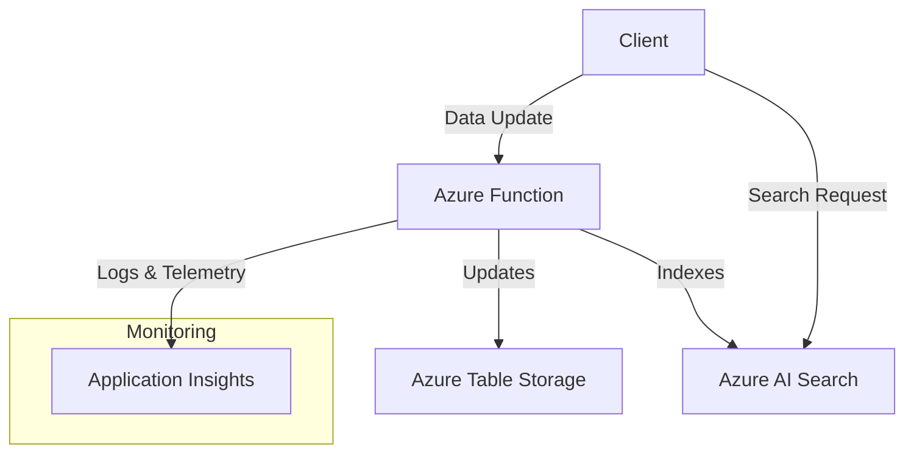

# Index Table Pattern on Azure

This repository demonstrates the **Index Table Pattern** on Azure, which uses Azure Table Storage to store data and Azure AI Search for efficient indexing and searching of that data. The architecture is designed for scenarios where quick and scalable search capabilities are needed over structured data.

## 🏗️ Architectural Overview

The **Index Table Pattern** architecture consists of the following components:

1. **Azure Function**: Handles data updates and triggers indexing in Azure AI Search.
2. **Azure Table Storage**: Stores the data in a scalable, low-cost NoSQL store.
3. **Azure AI Search**: Indexes the data stored in Azure Table Storage for fast search capabilities.
4. **Application Insights**: Monitors and collects telemetry data from the Azure Function.

### 📊 Architectural Diagram



## 📂 Repository Structure

```
/index-table-pattern
│
├── README.md                                  # Root README with architecture overview and getting started
├── LICENSE                                    # MIT License
│
├── infrastructure
│   ├── README.md                              # README for Infrastructure deployment
│   ├── azure-resources.bicep                  # Bicep template for all Azure resources
│   └── .github/workflows/deploy-bicep.yml     # GitHub Action to deploy Azure resources
│
└── azure-functions
    ├── README.md                              # README for Index Table Function
    ├── IndexTableFunction.csproj              # C# project file for Index Table Function
    ├── IndexTableFunction.cs                  # Main code for Index Table Function
    └── .github/workflows/deploy-index-function.yml # GitHub Action to deploy Index Table Function
```

## 🚀 Getting Started

### Step 1: Deploy the Infrastructure

1. **Navigate to the `infrastructure` Folder**:
   - Go to the **`infrastructure`** folder and follow the instructions in the [Infrastructure README](infrastructure/README.md) to deploy the required Azure resources using the Bicep template and GitHub Actions.

2. **Run the GitHub Action**:
   - The GitHub Actions workflow **`deploy-bicep.yml`** will automatically deploy the Azure resources defined in the Bicep template.

3. **Verify Deployment**:
   - After the deployment completes, verify that the Azure resources (Storage Account, Function App, AI Search, Application Insights) are properly created in your Azure subscription.

### Step 2: Deploy the Azure Function

1. **Navigate to the `azure-functions` Folder**:
   - Go to the **`azure-functions`** folder and follow the instructions in the [Function README](azure-functions/README.md) to deploy the Azure Function using GitHub Actions.

2. **Run the GitHub Action**:
   - The GitHub Actions workflow **`deploy-index-function.yml`** will automatically build and deploy the Azure Function.

### Step 3: Test the Azure Function

1. **Use Postman or Any HTTP Client**:
   - Follow the testing instructions in the [Function README](azure-functions/README.md) to send HTTP POST requests to the Azure Function to update data and verify that it is correctly stored in Azure Table Storage and indexed in Azure AI Search.

## 💡 How It Works

1. **Data Update**:
   - The **Azure Function** receives HTTP POST requests with JSON data, updates the data in **Azure Table Storage**, and then triggers indexing in **Azure AI Search**.

2. **Search Capabilities**:
   - **Azure AI Search** provides search capabilities over the data stored in Azure Table Storage, enabling quick and efficient searches.

3. **Monitoring**:
   - **Application Insights** collects telemetry data from the Azure Function, allowing you to monitor its performance, track errors, and gain insights into usage patterns.

## 🔍 Key Points to Remember

- **Environment Variables**: Ensure all required environment variables are properly set in your Azure Function App:
  - **`AzureWebJobsStorage`**: Connection string for the Azure Storage Account.
  - **`AzureAISearchEndpoint`**: Endpoint URL for your Azure AI Search service.
  - **`AzureAISearchApiKey`**: API key for your Azure AI Search service.
- **Monitor with Application Insights**: Check Application Insights to monitor the function's execution and gather telemetry data.

## 📊 Monitoring and Logging with Application Insights

This repository uses **Azure Application Insights** to monitor and collect telemetry data from the Azure Function. Application Insights helps to:

- Track request rates, response times, and failure rates.
- Monitor the performance of the Azure Function.
- Diagnose failures and exceptions.
- Gain insights into the usage patterns and overall health of the system.

### How to View Application Insights Data

1. Go to the **Azure Portal**.
2. Navigate to **Application Insights** and select the **`indexTableAppInsights`** resource.
3. Use the available tools to explore logs, requests, failures, dependencies, and custom metrics.

## 📄 License

This project is licensed under the MIT License - see the [LICENSE](LICENSE) file for details.

## 🙌 Contributing

Contributions are welcome! Please open an issue or submit a pull request for any improvements or suggestions.
